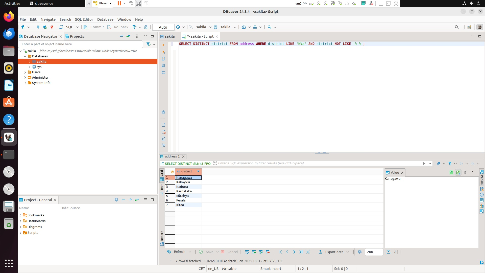
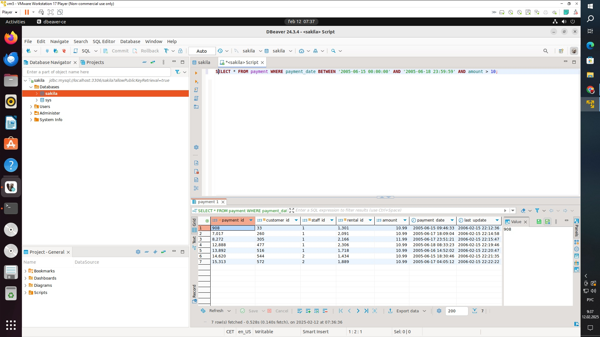
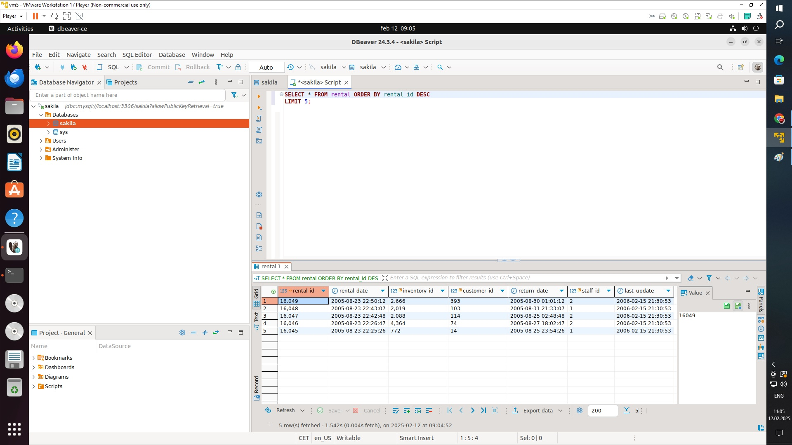
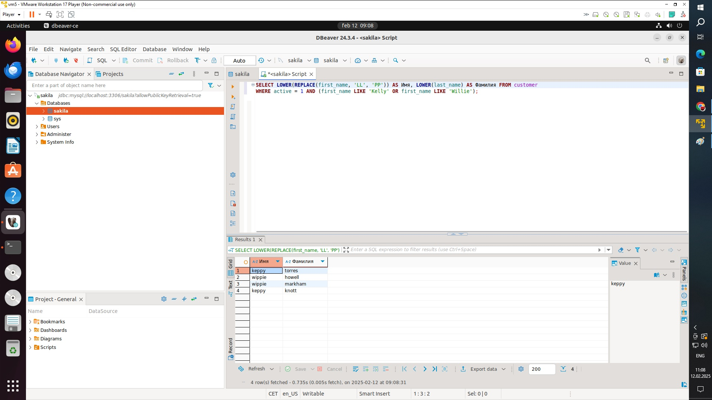
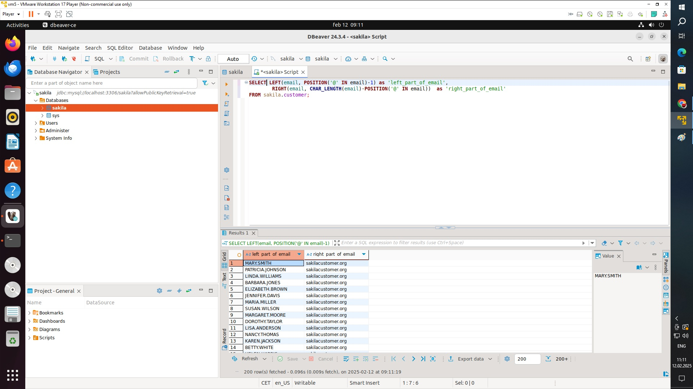

## Задание 1
Получите уникальные названия районов из таблицы с адресами, которые начинаются на “K” и заканчиваются на “a” и не содержат пробелов.

## Ответ:

SELECT DISTINCT district FROM address WHERE district LIKE 'K%a' AND district NOT LIKE '% %';

## Задание 2
Получите из таблицы платежей за прокат фильмов информацию по платежам, которые выполнялись в промежуток с 15 июня 2005 года по 18 июня 2005 года включительно и стоимость которых превышает 10.00.

## Ответ:

SELECT DISTINCT district FROM address WHERE district LIKE 'K%a' AND district NOT LIKE '% %';

## Задание 3
Получите последние пять аренд фильмов.

## Ответ:

SELECT * FROM rental ORDER BY rental_id DESC
LIMIT 5;

## Задание 4
Одним запросом получите активных покупателей, имена которых Kelly или Willie.

Сформируйте вывод в результат таким образом:

все буквы в фамилии и имени из верхнего регистра переведите в нижний регистр,
замените буквы 'll' в именах на 'pp'.

## Ответ:

SELECT REPLACE(LOWER(first_name), 'll', 'pp'), LOWER(last_name), active
FROM sakila.customer
WHERE first_name IN ('Kelly', 'Willie') and active = 1;

## Задание 5*
Выведите Email каждого покупателя, разделив значение Email на две отдельных колонки: в первой колонке должно быть значение, указанное до @, во второй — значение, указанное после @.

## Ответ:

SELECT LEFT(email, POSITION('@' IN email)-1) as 'left_part_of_email',
RIGHT(email, CHAR_LENGTH(email)-POSITION('@' IN email)) as 'right_part_of_email'
FROM sakila.customer

